# Agent-Cloud CLI: Architecture & Interview Preparation Guide

This guide provides an in-depth breakdown of the **Agent-Cloud CLI** project to help you master its flow, code structure, and architectural design so you can confidently answer any deep-dive questions during your interview.

---

## 1. System Architecture & Flow

The project is an AI-powered DevOps deployment orchestrator that scans local projects, designs cloud architecture plans, requests user approval, and provisions resources in the cloud (specifically Azure, with AWS/GCP designed as modular stubs).

### High-Level Flow Diagram

```mermaid
sequenceDiagram
    autonumber
    actor User as Developer
    participant CLI as Commander CLI (index.ts)
    participant WF as Mastra Workflow (deployment.ts)
    participant AG as AI Agents (Analyzer/Planner)
    participant PR as Azure Provider (azure/index.ts)
    participant DB as SQLite DB (LibSQLStore)

    User->>CLI: cloud deploy ./my-app
    CLI->>WF: Start deploymentWorkflow
    activate WF
    
    rect rgb(30, 41, 59)
        note right of WF: Phase 1: Environment Checks
        WF->>WF: cliChecker, authChecker, permissionsChecker
    end

    rect rgb(30, 41, 59)
        note right of WF: Phase 2: Project Analysis
        WF->>AG: Scan files, parse package.json, identify framework
        AG-->>WF: Project Analysis JSON
    end

    rect rgb(30, 41, 59)
        note right of WF: Phase 3: Infrastructure Planning
        WF->>AG: Generate services list, costs & terminal commands
        AG-->>WF: Deployment Plan JSON
    end

    rect rgb(45, 30, 59)
        note right of WF: Phase 4: Suspend & Approval Gate
        WF-->>CLI: Suspend Execution (returns Plan)
        CLI->>User: Display Plan & Ask for Approval (y/n)
        User-->>CLI: Approved: Yes
        CLI->>WF: Resume Workflow (approved=true)
    end

    rect rgb(30, 41, 59)
        note right of WF: Phase 5: Resource Provisioning
        WF->>PR: Authenticate & provision App Service / Blob Storage
        PR-->>WF: Live Endpoint URL & Status
    end

    WF->>DB: Save Deployment Record (SQLite)
    WF-->>CLI: Workflow Completed (success)
    deactivate WF
    CLI->>User: Display success banner & Live URL
```

---

## 2. Component Directory Breakdown

Here is where the core logic lives and why:

*   **`src/cli/`**: The presentation layer.
    *   [index.ts](file:///c:/Users/HP/OneDrive/Desktop/core%20project%20code/agent_ultimate_cloude/src/cli/index.ts): CLI entrypoint using `commander` defining command routes (`init`, `analyze`, `deploy`, `status`, `history`, `info`).
    *   [commands.ts](file:///c:/Users/HP/OneDrive/Desktop/core%20project%20code/agent_ultimate_cloude/src/cli/commands.ts): Core functions executing CLI logic (e.g., local project scanner).
    *   [prompts.ts](file:///c:/Users/HP/OneDrive/Desktop/core%20project%20code/agent_ultimate_cloude/src/cli/prompts.ts): Interactivity using `inquirer` for collecting credentials, options, and showing plans.
    *   [banner.ts](file:///c:/Users/HP/OneDrive/Desktop/core%20project%20code/agent_ultimate_cloude/src/cli/banner.ts): Custom visual layouts using `figlet` and `gradient-string` to provide a premium feel.
*   **`src/mastra/`**: The orchestration and intelligence layer.
    *   [index.ts](file:///c:/Users/HP/OneDrive/Desktop/core%20project%20code/agent_ultimate_cloude/src/mastra/index.ts): Registers agents, workflows, and sets up local SQLite database storage via `LibSQLStore`.
    *   `agents/`: Custom LLM personas ([analyzer.ts](file:///c:/Users/HP/OneDrive/Desktop/core%20project%20code/agent_ultimate_cloude/src/mastra/agents/analyzer.ts), [validator.ts](file:///c:/Users/HP/OneDrive/Desktop/core%20project%20code/agent_ultimate_cloude/src/mastra/agents/validator.ts), [deployment.ts](file:///c:/Users/HP/OneDrive/Desktop/core%20project%20code/agent_ultimate_cloude/src/mastra/agents/deployment.ts)) using model-switching hierarchies.
    *   `tools/`: Reusable capabilities given to agents ([index.ts](file:///c:/Users/HP/OneDrive/Desktop/core%20project%20code/agent_ultimate_cloude/src/mastra/tools/index.ts): fs scanners, dependency parsers; [deployment.ts](file:///c:/Users/HP/OneDrive/Desktop/core%20project%20code/agent_ultimate_cloude/src/mastra/tools/deployment.ts): cost estimators, service mappers; [validator.ts](file:///c:/Users/HP/OneDrive/Desktop/core%20project%20code/agent_ultimate_cloude/src/mastra/tools/validator.ts): env verification checkers).
    *   `workflows/`: Long-running stateful workflows. [deployment.ts](file:///c:/Users/HP/OneDrive/Desktop/core%20project%20code/agent_ultimate_cloude/src/mastra/workflows/deployment.ts) manages the sequence of deployment phases.
*   **`src/providers/`**: The cloud execution layer.
    *   `azure/`: Full Azure CLI implementation ([index.ts](file:///c:/Users/HP/OneDrive/Desktop/core%20project%20code/agent_ultimate_cloude/src/providers/azure/index.ts)) managing Resource Groups, Container Apps, Function Apps, Static Web Apps, Blob Storage, and App Services.
    *   `aws/` & `gcp/`: Stubs demonstrating clean inheritance and pluggability for multi-cloud structures.
*   **`src/utils/`**: Shared core systems.
    *   [logger.ts](file:///c:/Users/HP/OneDrive/Desktop/core%20project%20code/agent_ultimate_cloude/src/utils/logger.ts): Double-stream logger exporting console colored output and JSONL logs.
    *   [config.ts](file:///c:/Users/HP/OneDrive/Desktop/core%20project%20code/agent_ultimate_cloude/src/utils/config.ts): Local settings database saving user regions, default cloud, and historical deployments.
    *   [shell.ts](file:///c:/Users/HP/OneDrive/Desktop/core%20project%20code/agent_ultimate_cloude/src/utils/shell.ts): Security sanitizers (regex path validation, special character filters to block command injection).

---

## 3. Deep Dive on Advanced Patterns

### Human-in-the-Loop Workflow Suspension
One of the most impressive parts of this project is the **Workflow Suspension / Approval Gate**. In `src/mastra/workflows/deployment.ts`, when a step executes:
1. It validates, scans, and generates a plan.
2. If the user hasn't set `autoApprove`, the workflow step calls `return await suspend({ plan })`.
3. The engine suspends execution and returns status `'suspended'`.
4. The CLI reads this status, prints the plan in a clean visual table, and displays a confirmation prompt.
5. Once the user approves/rejects, the CLI invokes:
   `await runInstance.resume({ step: 'deployment-step', resumeData: { approved: true } })`
6. The workflow wakes up, receives `resumeData.approved` inside the step's `execute` function, and continues provisioning.

### Security: Input Sanitization & Command Injection Mitigation
DevOps CLIs are vulnerable to command injection because they run terminal scripts. This project solves this in `src/utils/shell.ts`:
*   **`shellEscape`**: Strips null bytes (`\0`) and uses a strict regex whitelist allowing only safe characters (alphanumeric, dashes, dots, spaces, forward slashes).
*   **`sanitizeResourceName`**: Converts strings to lowercase, replaces non-alphanumeric characters with single hyphens, eliminates consecutive hyphens, and truncates length to 63 characters (the standard limit for cloud resource subdomains).
*   **`sanitizePath`**: Eliminates path traversal attempts (replaces `../` and `..\` with empty strings).

---

## 4. Top 10 Mock Interview Questions & Answers

### Q1: What is Mastra and why did you choose it over standard LangChain/LlamaIndex?
*   **Answer**: Mastra is an lightweight, event-driven agent framework specifically designed for TypeScript/Node.js. Unlike LangChain which can feel overly abstracted and heavy, Mastra provides built-in first-class primitives for **custom tools**, **structured output agents**, and **durable workflows** (with suspend/resume state machines). It has minimal runtime overhead and clean typing support, making it perfect for lightweight developer tools like a CLI.

### Q2: How did you implement stateful orchestration in the deployment workflow?
*   **Answer**: I used Mastra Workflows. A workflow step (`deploymentStep`) is defined with custom input, output, suspend, and resume validation schemas. When running, if user approval is needed, the step calls the `suspend()` function, saving its current execution context. The workflow execution is persisted using Mastra's storage layer (LibSQL/SQLite), allowing the CLI to query the status or resume it later using the unique `runId`.

### Q3: How do the AI agents inside the CLI interact?
*   **Answer**: We have three specialized agents:
    1.  `project-analyzer`: Uses scanning tools to inspect the folder structure, read dependencies (`package.json`), and output a standardized project profile.
    2.  `deployment-planner`: Takes the project profile and maps it to cloud services, estimates monthly costs, and generates execution steps.
    3.  `environment-validator`: Verifies target CLI installations (AWS/GCP/Azure), checks active API keys, and tests network latency.
    They run sequentially within our deployment pipeline, passing output parameters from one phase to the next.

### Q4: How did you ensure type safety when parsing LLM outputs?
*   **Answer**: In our agent instructions, we specify a strict JSON schema. Furthermore, we define Mastra custom tools using `zod` schemas (`inputSchema` and `outputSchema`). When parsing, we feed the raw text through a regex filter to extract the JSON block and validate it using schema parsing, ensuring that any missing keys or format changes do not cause runtime failures.

### Q5: How does the Azure cloud provisioning work under the hood?
*   **Answer**: I built an `AzureProvider` class that acts as a wrapper around the Azure CLI. It uses Node's `child_process.execSync` to run CLI commands like `az group create`, `az storage account create`, and `az containerapp create` synchronously. It parses the JSON output of these commands to retrieve endpoint URLs, resource IDs, and verification statuses.

### Q6: Why are AWS and GCP providers stubbed while Azure is fully coded?
*   **Answer**: This demonstrates a clean **adapter design pattern**. The orchestrator/workflow is cloud-agnostic; it interacts with a generic cloud interface. By implementing Azure fully and stubbing AWS/GCP, I showed that the CLI architecture is built for multi-cloud extensibility. If we want to add AWS tomorrow, we only need to fill in the methods of `AWSProvider` without touching the workflow engine or the CLI commands.

### Q7: How do you handle secrets and credentials safely in this CLI?
*   **Answer**: We do not store secrets in cleartext or in a remote database. Instead, the CLI writes credentials (like AI provider API keys or subscription IDs) directly to a local `.env` file in the user's workspace directory. The application reads these variables via `dotenv/config` at launch. Additionally, we check CLI tool logins directly via command checks (e.g. `az account show` or `aws sts get-caller-identity`) rather than prompting for raw access keys.

### Q8: How did you manage logging and metrics?
*   **Answer**: I implemented a double-stream `Logger` utility. Every event is printed in real-time to the terminal with clean color-coded layouts (green for success, red for errors, cyan for info). Simultaneously, a verbose entry with a timestamp, log level, session ID, and metadata is serialized as JSON and appended to a JSON Lines (JSONL) file under `.agent-cloud/logs`. This ensures developers can review exact execution traces for debugging.

### Q9: What happens if a step in the deployment workflow fails?
*   **Answer**: The entire execute block is wrapped in a robust try-catch handler coupled with custom domain errors (e.g. `DeploymentError`, `ValidationError`). If any step fails, the duration is captured, the error message is recorded, a failed deployment record is persisted into the Config Manager history, and the workflow gracefully exits with a `'failed'` status, preventing incomplete configurations from hanging.

### Q10: If you had more time, how would you improve this project?
*   **Answer**: I would:
    1.  Fully implement the GCP and AWS providers.
    2.  Add a Web UI dashboard utilizing Mastra's built-in server route streaming so developers can monitor deployments in their browser.
    3.  Implement state rollbacks: if a deployment fails halfway, execute a cleanup sequence to teardown half-provisioned cloud resources to prevent unwanted billing.
